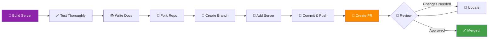

# Contributing Your MCP Server

???+ abstract "Share Your Work"
    Ready to contribute your MCP server to the community? This guide covers the complete process of submitting your server to the [mcp-context-forge](https://github.com/IBM/mcp-context-forge) repository and joining the growing MCP ecosystem.

---

## 1. Why Contribute?

Contributing your MCP server to mcp-context-forge:

- **Helps others** - Share tools that solve real problems
- **Builds portfolio** - Showcase your work on a high-visibility project
- **Gets feedback** - Learn from code reviews
- **Grows ecosystem** - Expand the MCP tool landscape
- **Establishes expertise** - Build reputation in the MCP community

---

## 2. Submission Process Overview



---

## 3. Before You Submit

### 3.1 Quality Checklist

Ensure your server meets these standards:

- [ ] **Working code** - Server runs without errors
- [ ] **Multiple transports** - Supports both STDIO and HTTP
- [ ] **Tested** - Unit tests with 90%+ coverage
- [ ] **Documented** - Comprehensive README.md
- [ ] **Dependencies** - Clear `pyproject.toml` or `requirements.txt`
- [ ] **Type hints** - Full type annotations
- [ ] **Error handling** - Graceful failure modes
- [ ] **Examples** - Working usage examples
- [ ] **Best practices** - Follows [best practices](https://github.com/IBM/mcp-context-forge/blob/main/docs/best-practices.md)

### 3.2 Required Files

```
your-server-name/
├── README.md              # Required: Complete documentation
├── pyproject.toml        # Required: Dependencies and metadata
├── Makefile              # Required: Standard targets
├── Containerfile         # Required: Docker/Podman build
├── src/
│   └── your_server/
│       ├── __init__.py
│       ├── server.py     # Main server implementation
│       └── tools/
│           └── *.py
├── tests/
│   ├── __init__.py
│   └── test_*.py         # Comprehensive tests
├── .gitignore
└── LICENSE               # Apache 2.0 recommended
```

### 3.3 Makefile Requirements

Your Makefile must include these targets:

```makefile
# Required targets
venv:          # Create virtual environment
install:       # Install dependencies
serve:         # Run the server
test:          # Run tests
lint:          # Run linters
docs:          # Generate documentation
podman:        # Build container
podman-run:    # Run container
clean:         # Clean build artifacts
```

See [best practices](https://github.com/IBM/mcp-context-forge/blob/main/docs/best-practices.md) for full details.

---

## 4. Fork and Clone the Repository

### 4.1 Fork on GitHub

1. Go to [github.com/IBM/mcp-context-forge](https://github.com/IBM/mcp-context-forge)
2. Click **"Fork"** button (top-right)
3. Select your account

### 4.2 Clone Your Fork

```bash
# Clone via SSH (recommended)
git clone git@github.com:YOUR-USERNAME/mcp-context-forge.git
cd mcp-context-forge

# Or via HTTPS
git clone https://github.com/YOUR-USERNAME/mcp-context-forge.git
cd mcp-context-forge
```

### 4.3 Add Upstream Remote

```bash
# Track the original repository
git remote add upstream git@github.com:IBM/mcp-context-forge.git

# Verify remotes
git remote -v
```

---

## 5. Create Your Server

### 5.1 Create Feature Branch

```bash
# Create and switch to feature branch
git checkout -b add-weather-server

# Use descriptive names
git checkout -b add-your-server-name
```

### 5.2 Create Server Directory

```bash
# Navigate to Python servers directory
cd mcp-servers/python

# Create your server directory
mkdir your-server-name
cd your-server-name
```

### 5.3 Project Structure

```bash
# Initialize project
uv init --python 3.11

# Create standard structure
mkdir -p src/your_server/tools
mkdir -p tests
touch src/your_server/__init__.py
touch src/your_server/server.py
touch src/your_server/tools/__init__.py
touch tests/__init__.py
touch tests/test_server.py
touch Containerfile
touch Makefile
```

---

## 6. Write Your Server

### 6.1 Server Implementation

```python
# src/your_server/server.py
from fastmcp import FastMCP
import logging

logger = logging.getLogger(__name__)

mcp = FastMCP("your-server", version="1.0.0")

@mcp.tool(description="Your tool description")
async def your_tool(param: str) -> dict:
    """
    Detailed tool documentation.

    Args:
        param: Parameter description

    Returns:
        Result description
    """
    try:
        # Implementation
        result = process(param)
        return {"status": "success", "data": result}

    except Exception as e:
        logger.error(f"Tool failed: {e}", exc_info=True)
        raise

if __name__ == "__main__":
    mcp.run()
```

### 6.2 Configuration

```toml
# pyproject.toml
[build-system]
requires = ["hatchling"]
build-backend = "hatchling.build"

[project]
name = "your-server"
version = "1.0.0"
description = "Brief description of your server"
readme = "README.md"
requires-python = ">=3.11"
license = {text = "Apache-2.0"}

dependencies = [
    "fastmcp>=2.13.0",
    "httpx>=0.27.0",
]

[project.optional-dependencies]
dev = [
    "pytest>=8.0.0",
    "pytest-asyncio>=0.24.0",
    "pytest-cov>=5.0.0",
    "ruff>=0.8.0",
]

[tool.ruff]
line-length = 100
target-version = "py311"
```

### 6.3 Containerfile

```dockerfile
# Containerfile
FROM registry.access.redhat.com/ubi9/python-311:latest

WORKDIR /app

# Install uv
COPY --from=ghcr.io/astral-sh/uv:latest /uv /bin/uv

# Copy dependency files
COPY pyproject.toml .
COPY README.md .

# Install dependencies
RUN uv venv /app/.venv && \
    uv pip install --no-cache -e .

# Copy source
COPY src/ ./src/

# Create non-root user
RUN useradd -m -u 1000 mcpuser && \
    chown -R mcpuser:mcpuser /app

USER mcpuser

EXPOSE 8080

ENV PATH="/app/.venv/bin:$PATH"
CMD ["python", "-m", "your_server.server"]
```

---

## 7. Write Documentation

### 7.1 README Template

```markdown
# Your Server Name

Brief description of what your server does (1-2 sentences).

## Features

- List key capabilities
- Highlight unique functionality
- Mention integrations or use cases

## Installation

```bash
# Clone repository
cd mcp-servers/python/your-server-name

# Install dependencies
make install

# Run server
make serve
```

## Usage

### STDIO Mode

```bash
fastmcp run src/your_server/server.py
```

### HTTP Mode

```bash
fastmcp run src/your_server/server.py --transport http --port 8000
```

## Available Tools

### tool_name

**Description:** What this tool does

**Parameters:**

- `param1` (string, required): Description
- `param2` (int, optional): Description, default: 10

**Returns:**
```json
{
  "status": "success",
  "data": "result"
}
```

**Example:**
```bash
# Using FastMCP client
python -c "
import asyncio
from fastmcp import Client

async def main():
    async with Client('http://localhost:8000/mcp') as client:
        result = await client.call_tool('tool_name', {'param1': 'value'})
        print(result.content[0].text)

asyncio.run(main())
"
```

## Testing

```bash
# Run tests
make test

# Run with coverage
pytest --cov=src --cov-report=html
```

## Integration with ContextForge

1. Start your server:
   ```bash
   make serve  # or fastmcp run src/your_server/server.py --transport http
   ```

2. Register with gateway:
   ```bash
   export MCPGATEWAY_BEARER_TOKEN="your-token"
   curl -X POST http://localhost:4444/servers \
     -H "Authorization: Bearer $MCPGATEWAY_BEARER_TOKEN" \
     -H "Content-Type: application/json" \
     -d '{
       "name": "your-server",
       "url": "http://localhost:8000/mcp",
       "description": "Your server description"
     }'
   ```

3. Test via gateway:
   ```bash
   # List tools
   curl http://localhost:4444/mcp \
     -H "Authorization: Bearer $MCPGATEWAY_BEARER_TOKEN" \
     -H "Content-Type: application/json" \
     -d '{"jsonrpc": "2.0", "id": 1, "method": "tools/list"}'
   ```

## Docker/Podman

```bash
# Build image
make podman

# Run container
make podman-run

# Test container
curl http://localhost:8080/health
```

## Dependencies

- Python 3.11+
- fastmcp >= 2.13.0
- (list other key dependencies)

## Environment Variables

- `API_KEY`: Your API key (if needed)
- `LOG_LEVEL`: Logging level (default: INFO)

## Contributing

See [CONTRIBUTING.md](../../CONTRIBUTING.md)

## License

Apache 2.0

## Author

Your Name (@your-github-handle)
```

---

## 8. Write Tests

### 8.1 Comprehensive Test Suite

```python
# tests/test_server.py
import pytest
from fastmcp.testing import create_test_client
from your_server.server import mcp

@pytest.mark.asyncio
async def test_tool_registration():
    """Test that tools are registered correctly."""
    async with create_test_client(mcp) as client:
        tools = await client.list_tools()
        tool_names = [t.name for t in tools]

        assert "your_tool" in tool_names

@pytest.mark.asyncio
async def test_tool_execution():
    """Test tool executes correctly."""
    async with create_test_client(mcp) as client:
        result = await client.call_tool("your_tool", {"param": "test"})

        assert result.content[0].text
        assert "success" in result.content[0].text

@pytest.mark.asyncio
async def test_error_handling():
    """Test error handling."""
    async with create_test_client(mcp) as client:
        with pytest.raises(Exception):
            await client.call_tool("your_tool", {"param": ""})
```

### 8.2 Test Coverage

```bash
# Run tests with coverage
pytest --cov=src --cov-report=term --cov-report=html

# Ensure >90% coverage
pytest --cov=src --cov-fail-under=90
```

---

## 9. Submit Your Contribution

### 9.1 Commit Your Changes

```bash
# Stage all files
git add mcp-servers/python/your-server-name/

# Commit with clear message
git commit -m "Add [Your Server Name] MCP server

- Implements [list main tools]
- Supports STDIO and HTTP transports
- Includes comprehensive tests (95% coverage)
- Full documentation with examples
- Containerfile for deployment"
```

### 9.2 Push to Your Fork

```bash
# Push your branch
git push origin add-your-server-name
```

### 9.3 Create Pull Request

1. Go to your fork on GitHub
2. Click **"Compare & pull request"**
3. Fill out PR template:

```markdown
## Summary
This PR adds a [brief description] MCP server.

## Server Details
- **Name:** your-server-name
- **Location:** `mcp-servers/python/your-server-name/`
- **Transports:** STDIO, HTTP
- **Tools:**
  - `tool_name`: Description

## Testing
- [x] Unit tests pass (95% coverage)
- [x] Integration tests with ContextForge Gateway
- [x] Linting passes (ruff)
- [x] Type checking passes (mypy)
- [x] Container builds successfully

## Documentation
- [x] Comprehensive README.md
- [x] Usage examples
- [x] API documentation
- [x] Environment variables documented

## Checklist
- [x] Follows [best practices](https://github.com/IBM/mcp-context-forge/blob/main/docs/best-practices.md)
- [x] Includes all required files (Makefile, Containerfile, tests)
- [x] No secrets or credentials committed
- [x] Apache 2.0 license (or compatible)
```

4. Click **"Create pull request"**

---

## 10. Review Process

### 10.1 What to Expect

Reviewers will check:

- **Code quality** - Clean, readable, well-structured
- **Tests** - Comprehensive coverage, all passing
- **Documentation** - Clear, complete, accurate
- **Best practices** - Follows project standards
- **Security** - No vulnerabilities or secrets

### 10.2 Responding to Feedback

```bash
# Make requested changes
# ... edit files ...

# Commit and push
git add .
git commit -m "Address review feedback: improve error messages"
git push origin add-your-server-name
```

The PR updates automatically!

### 10.3 Common Feedback

- Add more test coverage
- Improve error messages
- Update documentation
- Fix linting issues
- Add type hints
- Handle edge cases

---

## 11. After Merge

### 11.1 Cleanup

```bash
# Switch to main and update
git checkout main
git pull upstream main

# Delete feature branch
git branch -d add-your-server-name
git push origin --delete add-your-server-name
```

### 11.2 Share Your Success

- Star the repository
- Share on social media
- Write a blog post
- Help others use your server

---

## 12. Contribution Guidelines

### 12.1 Code Style

- **Python:** Follow PEP 8, use ruff for linting
- **Type hints:** Required for all functions
- **Docstrings:** Google-style docstrings
- **Naming:** Clear, descriptive names

### 12.2 Testing Standards

- **Coverage:** Minimum 90%
- **Test types:** Unit, integration, contract
- **Async tests:** Use pytest-asyncio
- **Mocking:** Mock external dependencies

### 12.3 Documentation Standards

- **README:** Complete, clear, tested examples
- **Code comments:** Explain why, not what
- **API docs:** Document all parameters and returns
- **Examples:** Working, copy-paste ready

---

## 13. Repository Capabilities Tags

Add metadata tags to your README for ContextForge:

```markdown
---
tags:
  - needs_network_access_outbound  # Makes API calls
  - needs_api_key_user              # User provides API key
---

# Your Server Name
...
```

Available tags:

- `needs_filesystem_access` - Reads/writes local files
- `needs_api_key_user` - User-provided API key
- `needs_api_key_central` - Centrally managed API key
- `needs_database` - Database access
- `needs_network_access_inbound` - Receives requests
- `needs_network_access_outbound` - Makes external requests

---

## 14. Getting Help

### 14.1 Resources

- **[Best Practices](https://github.com/IBM/mcp-context-forge/blob/main/docs/best-practices.md)** - Coding standards
- **[Example Servers](https://github.com/IBM/mcp-context-forge/tree/main/mcp-servers/python)** - Reference implementations
- **[FastMCP Docs](https://gofastmcp.com/)** - Framework documentation

### 14.2 Community

- **GitHub Discussions** - Ask questions, share ideas
- **GitHub Issues** - Report bugs or request features
- **Pull Request Comments** - Get feedback during review

???+ tip "Be Patient"
    Reviews may take a few days. Reviewers are volunteers helping improve the project. Thank them for their time and feedback!

---

## 15. Beyond Your First Contribution

### 15.1 Maintain Your Server

- Respond to issues users file
- Update for new FastMCP versions
- Add features based on feedback
- Fix bugs promptly

### 15.2 Review Others' PRs

Give back by reviewing:

- Test their servers
- Provide constructive feedback
- Share best practices
- Welcome new contributors

### 15.3 Contribute More

- Add more servers
- Improve documentation
- Fix bugs
- Enhance existing servers

---

## Congratulations!

🎉 You're ready to contribute to the MCP ecosystem!

Your server will help developers worldwide build better AI agents. Thank you for contributing!

**Next steps:**

1. **[Build Your Server](developing-your-mcp-server.md)** - Create your MCP server
2. **[Test Thoroughly](testing.md)** - Ensure quality
3. **[Set Up Git](github-guide.md)** - Learn Git/GitHub if needed
4. Submit your PR and join the community!

Welcome to the MCP community! 🚀
