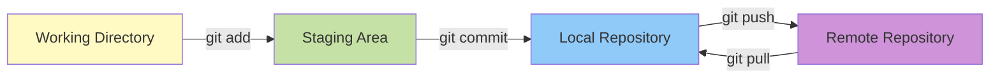
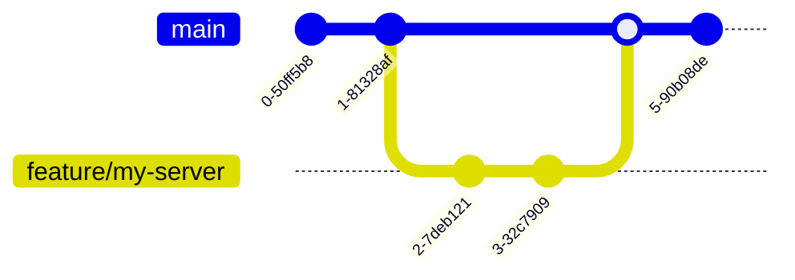

# GitHub Guide for MCP Development

???+ info "What you'll learn"
    This guide walks you through using Git and GitHub for MCP server development. Whether you're contributing to mcp-context-forge or managing your own repositories, you'll learn:

    - **Set up SSH keys** for secure authentication with GitHub
    - **Fork and clone** repositories to your local machine
    - **Create feature branches** and organize your work
    - **Commit and push changes** using Git best practices
    - **Create pull requests** and navigate the review process
    - **Collaborate effectively** with the MCP community

???+ success "Prerequisites"
    - [x] Git installed on your machine
    - [x] A GitHub account (free account works fine)
    - [x] Basic command line familiarity

---

## 1. Understanding Git and GitHub

### 1.1 Git vs GitHub

- **Git** - Version control system that tracks changes to your code
- **GitHub** - Platform for hosting Git repositories and collaborating

### 1.2 Core Git Concepts



- **Working Directory** - Your local files
- **Staging Area** - Changes marked for commit
- **Local Repository** - Your local Git history
- **Remote Repository** - GitHub hosted repository

---

## 2. Setting Up Git

### 2.1 Install Git

=== "macOS"
    ```bash
    # Using Homebrew
    brew install git

    # Or download from https://git-scm.com/
    ```

=== "Linux"
    ```bash
    # Debian/Ubuntu
    sudo apt update && sudo apt install git

    # Fedora
    sudo dnf install git

    # Arch
    sudo pacman -S git
    ```

=== "Windows"
    ```powershell
    # Using winget
    winget install Git.Git

    # Or download from https://git-scm.com/
    ```

### 2.2 Configure Git

```bash
# Set your name (appears in commits)
git config --global user.name "Your Name"

# Set your email (use your GitHub email)
git config --global user.email "your.email@example.com"

# Set default branch name
git config --global init.defaultBranch main

# Verify configuration
git config --list
```

### 2.3 Set Up SSH Keys for GitHub

SSH keys provide secure, password-free authentication with GitHub.

#### Check for existing keys

```bash
# List existing SSH keys
ls -la ~/.ssh

# Look for files like:
# id_rsa.pub, id_ed25519.pub, id_ecdsa.pub
```

#### Generate a new SSH key

```bash
# Generate Ed25519 key (recommended)
ssh-keygen -t ed25519 -C "your.email@example.com"

# Or if your system doesn't support Ed25519, use RSA
ssh-keygen -t rsa -b 4096 -C "your.email@example.com"

# When prompted:
# - File location: Press Enter for default (~/.ssh/id_ed25519)
# - Passphrase: Enter a strong passphrase (recommended for security)
```

#### Add key to SSH agent

```bash
# Start SSH agent
eval "$(ssh-agent -s)"

# Add your key
ssh-add ~/.ssh/id_ed25519

# On macOS, also add to keychain
ssh-add --apple-use-keychain ~/.ssh/id_ed25519
```

#### Add SSH key to GitHub

1. **Copy your public key:**

   ```bash
   # macOS
   pbcopy < ~/.ssh/id_ed25519.pub

   # Linux (requires xclip)
   xclip -selection clipboard < ~/.ssh/id_ed25519.pub

   # Or display to copy manually
   cat ~/.ssh/id_ed25519.pub
   ```

2. **Add to GitHub:**
   - Go to [github.com/settings/keys](https://github.com/settings/keys)
   - Click **"New SSH key"**
   - Title: e.g., "My Laptop - 2025"
   - Paste your public key
   - Click **"Add SSH key"**

3. **Test connection:**

   ```bash
   ssh -T git@github.com
   # Should return: "Hi username! You've successfully authenticated..."
   ```

???+ tip "Multiple SSH keys"
    If you use multiple GitHub accounts or services, configure `~/.ssh/config`:

    ```
    # Personal GitHub
    Host github.com
      HostName github.com
      User git
      IdentityFile ~/.ssh/id_ed25519_personal

    # Work GitHub
    Host github-work
      HostName github.com
      User git
      IdentityFile ~/.ssh/id_ed25519_work
    ```

---

## 3. Working with Repositories

### 3.1 Clone a Repository

```bash
# Clone via HTTPS
git clone https://github.com/IBM/mcp-context-forge.git

# Clone via SSH (recommended if you have SSH keys)
git clone git@github.com:IBM/mcp-context-forge.git

# Clone to specific directory
git clone git@github.com:IBM/mcp-context-forge.git my-local-folder

# Navigate into cloned repo
cd mcp-context-forge
```

### 3.2 Fork a Repository

Forking creates your own copy for making changes.

1. Go to the repository on GitHub
2. Click **"Fork"** button (top-right)
3. Select your account as destination
4. Clone your fork:

   ```bash
   git clone git@github.com:YOUR-USERNAME/mcp-context-forge.git
   cd mcp-context-forge
   ```

### 3.3 Set Up Remote Tracking

```bash
# Add upstream remote (original repo)
git remote add upstream git@github.com:IBM/mcp-context-forge.git

# Verify remotes
git remote -v
# Should show:
# origin    git@github.com:YOUR-USERNAME/mcp-context-forge.git (your fork)
# upstream  git@github.com:IBM/mcp-context-forge.git (original)
```

---

## 4. Branching Strategy

### 4.1 Understanding Branches



### 4.2 Create and Switch Branches

```bash
# Create and switch to new branch
git checkout -b feature/my-mcp-server

# Or using newer syntax
git switch -c feature/my-mcp-server

# List all branches
git branch

# Switch to existing branch
git checkout main
```

### 4.3 Branch Naming Conventions

Use clear, descriptive names:

```bash
# Good names
git checkout -b feature/weather-api-server
git checkout -b fix/timeout-handling
git checkout -b docs/update-readme

# Avoid
git checkout -b new-branch
git checkout -b test
git checkout -b wip
```

---

## 5. Making Changes

### 5.1 Basic Workflow

```bash
# 1. Check current status
git status

# 2. Make your changes
# ... edit files ...

# 3. Review what changed
git diff

# 4. Stage specific files
git add path/to/file.py

# Or stage all changes
git add .

# 5. Commit with message
git commit -m "Add weather API MCP server

- Implements current_weather and forecast tools
- Supports both HTTP and STDIO transports
- Includes comprehensive error handling"

# 6. Push to your fork
git push origin feature/my-mcp-server
```

### 5.2 Commit Message Best Practices

```bash
# ✅ Good commit message
git commit -m "Add retry logic with exponential backoff

- Implement retry decorator for transient failures
- Configure max retries and backoff multiplier
- Add unit tests for retry behavior
- Update documentation with retry examples"

# ❌ Poor commit messages
git commit -m "fixed stuff"
git commit -m "WIP"
git commit -m "asdfasdf"
```

**Good commit messages:**

- Start with imperative verb (Add, Fix, Update, Remove)
- First line: concise summary (50 chars or less)
- Blank line, then detailed explanation
- Explain **what** and **why**, not how

### 5.3 Amending Commits

```bash
# Forgot to add a file
git add forgotten-file.py
git commit --amend --no-edit

# Fix commit message
git commit --amend -m "Corrected commit message"

# ⚠️ Only amend commits that haven't been pushed!
```

---

## 6. Synchronizing with Upstream

### 6.1 Keep Your Fork Updated

```bash
# Switch to main branch
git checkout main

# Fetch latest from upstream
git fetch upstream

# Merge upstream changes
git merge upstream/main

# Or rebase (cleaner history)
git rebase upstream/main

# Push updates to your fork
git push origin main
```

### 6.2 Update Feature Branch

```bash
# Option 1: Merge main into feature branch
git checkout feature/my-server
git merge main

# Option 2: Rebase feature branch (cleaner history)
git checkout feature/my-server
git rebase main
```

---

## 7. Creating Pull Requests

### 7.1 Before Creating PR

```bash
# 1. Make sure branch is up to date
git checkout main
git pull upstream main
git checkout feature/my-server
git rebase main

# 2. Run tests
pytest

# 3. Lint code
ruff check .
ruff format .

# 4. Push to your fork
git push origin feature/my-server
```

### 7.2 Create PR on GitHub

1. Go to your fork on GitHub
2. Click **"Compare & pull request"** banner

   OR:

3. Click **"Pull requests"** → **"New pull request"**
4. Select base: `IBM/mcp-context-forge:main`
5. Select compare: `YOUR-USERNAME/mcp-context-forge:feature/my-server`

### 7.3 PR Template

```markdown
## Summary
Brief description of what this PR does.

## Changes
- Add weather API MCP server
- Implement current_weather and forecast tools
- Add comprehensive error handling
- Include unit tests with 90%+ coverage

## Testing
- [x] All tests pass
- [x] Linting passes
- [x] Server runs in STDIO mode
- [x] Server runs in HTTP mode
- [x] Tested with ContextForge Gateway

## Screenshots/Examples
```bash
# Example usage
fastmcp run src/weather_server/server.py --transport http
```

## Checklist
- [x] Code follows project style guidelines
- [x] Documentation updated
- [x] Tests added/updated
- [x] No breaking changes (or documented)
```

---

## 8. Responding to Review Feedback

### 8.1 Making Changes After Review

```bash
# Make requested changes
# ... edit files ...

# Commit and push
git add .
git commit -m "Address review feedback: improve error messages"
git push origin feature/my-server
```

The PR automatically updates!

### 8.2 Handling Merge Conflicts

```bash
# Update your branch with latest main
git checkout main
git pull upstream main
git checkout feature/my-server
git rebase main

# If conflicts occur:
# 1. Git will pause and show conflicting files
git status

# 2. Edit files to resolve conflicts
# Look for markers: <<<<<<<, =======, >>>>>>>

# 3. Stage resolved files
git add resolved-file.py

# 4. Continue rebase
git rebase --continue

# 5. Force push (rebase rewrites history)
git push origin feature/my-server --force-with-lease
```

---

## 9. Git Best Practices

### 9.1 Commit Hygiene

✅ **Do:**

- Commit frequently with small, focused changes
- Write clear, descriptive commit messages
- Test before committing
- Keep commits atomic (one logical change per commit)

❌ **Don't:**

- Commit large, unrelated changes together
- Use vague messages like "fix bug" or "update"
- Commit broken code
- Include secrets or sensitive data

### 9.2 Branch Hygiene

```bash
# Delete merged branches locally
git branch -d feature/my-server

# Delete remote branches
git push origin --delete feature/my-server

# Prune deleted remote branches
git fetch --prune
```

### 9.3 .gitignore

```bash
# Common Python ignores
echo "
# Python
__pycache__/
*.py[cod]
*$py.class
*.so
.Python
venv/
.venv/
env/

# Testing
.pytest_cache/
.coverage
htmlcov/

# IDE
.vscode/
.idea/
*.swp

# OS
.DS_Store
Thumbs.db

# Environment
.env
.env.local
*.pem
*.key
" > .gitignore
```

---

## 10. Advanced Git Operations

### 10.1 Stashing Changes

```bash
# Save work in progress
git stash

# List stashes
git stash list

# Apply most recent stash
git stash pop

# Apply specific stash
git stash apply stash@{1}

# Drop stash
git stash drop
```

### 10.2 Cherry-Picking

```bash
# Apply specific commit from another branch
git cherry-pick <commit-hash>

# Cherry-pick multiple commits
git cherry-pick <hash1> <hash2>
```

### 10.3 Interactive Rebase

```bash
# Rewrite last 3 commits
git rebase -i HEAD~3

# Options in editor:
# pick   - keep commit as-is
# reword - change commit message
# edit   - modify commit
# squash - merge with previous commit
# drop   - remove commit
```

---

## 11. Troubleshooting

### 11.1 Common Issues

**Authentication failed:**
```bash
# Check SSH key is added
ssh -T git@github.com

# Re-add SSH key
ssh-add ~/.ssh/id_ed25519
```

**Diverged branches:**
```bash
# If local and remote have diverged
git pull --rebase origin feature/my-branch
```

**Accidentally committed to wrong branch:**
```bash
# Move commit to new branch
git branch feature/correct-branch
git reset --hard HEAD~1
git checkout feature/correct-branch
```

**Undo last commit (keep changes):**
```bash
git reset --soft HEAD~1
```

**Completely undo changes:**
```bash
# Discard all local changes
git reset --hard HEAD

# Discard specific file
git checkout -- file.py
```

### 11.2 Getting Help

```bash
# Git help
git help <command>
git help commit

# Quick reference
git <command> --help

# Check Git version
git --version
```

---

## 12. GitHub Features

### 12.1 Issues

```markdown
# Create detailed issue reports

**Title**: Weather API returns 500 on timeout

**Description**:
When the external weather API times out, the MCP server returns a 500 error instead of gracefully handling it.

**Steps to Reproduce**:

1. Start server: `fastmcp run server.py`
2. Call weather tool with slow network
3. Observe 500 error

**Expected Behavior**:
Server should retry with exponential backoff or return user-friendly error.

**Environment**:

- Python 3.11
- FastMCP 2.13
- Ubuntu 22.04

**Logs**:
```
[error stack trace]
```
```

### 12.2 Discussions

Use GitHub Discussions for:

- Questions about usage
- Feature ideas
- Community feedback
- Showcasing projects

### 12.3 GitHub Actions

Automated workflows run on PR:

- Tests
- Linting
- Type checking
- Build verification

Check workflow status in PR!

---

## 13. Quick Reference

### 13.1 Essential Commands

```bash
# Clone repository
git clone git@github.com:IBM/mcp-context-forge.git

# Create branch
git checkout -b feature/my-feature

# Stage and commit
git add .
git commit -m "Clear message"

# Push to remote
git push origin feature/my-feature

# Pull latest
git pull upstream main

# Check status
git status

# View history
git log --oneline --graph

# Diff changes
git diff
```

### 13.2 Git Aliases

```bash
# Set up useful aliases
git config --global alias.st status
git config --global alias.co checkout
git config --global alias.br branch
git config --global alias.ci commit
git config --global alias.unstage 'reset HEAD --'
git config --global alias.last 'log -1 HEAD'
git config --global alias.visual 'log --oneline --graph --all'

# Use them
git st  # instead of git status
git visual  # pretty log
```

---

## 14. Learning Resources

### 14.1 Official Documentation

- **[Git Book](https://git-scm.com/book)** - Comprehensive Git guide
- **[GitHub Docs](https://docs.github.com/)** - GitHub features and workflows
- **[GitHub Skills](https://skills.github.com/)** - Interactive tutorials

### 14.2 Practice

- **[Learn Git Branching](https://learngitbranching.js.org/)** - Interactive visualization
- **[GitHub Learning Lab](https://lab.github.com/)** - Hands-on courses
- **[Oh My Git!](https://ohmygit.org/)** - Git learning game

### 14.3 Cheat Sheets

- **[GitHub Git Cheat Sheet](https://education.github.com/git-cheat-sheet-education.pdf)** - Quick reference
- **[Atlassian Git Tutorials](https://www.atlassian.com/git/tutorials)** - Detailed guides

---

## Next Steps

Now that you understand Git and GitHub, you're ready to:

1. **[Contribute to mcp-context-forge](contributing.md)** - Submit your MCP server
2. **[CI/CD Guide](cicd.md)** - Automate your Git workflows
3. **[Testing](testing.md)** - Test before committing

???+ success "You're ready!"
    With Git and GitHub skills, you can collaborate effectively on MCP projects and contribute to the open-source community!
