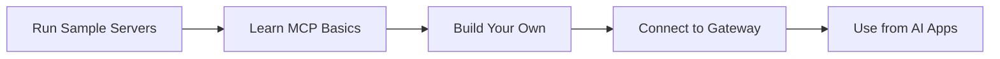

# MCP Workshop

???+ abstract "What We'll Build Together"
    In this hands-on workshop, we'll go from "What's MCP?" to "Check out my production server!" You'll build three increasingly awesome MCP servers while learning the tricks that took me months to figure out (so you don't have to).

    **We'll cover the fun stuff AND the battle-hardened stuff:**

    - **The Good Foundations**: FastMCP patterns, async/await done right, choosing between STDIO/HTTP/SSE transports, proper schema validation with Pydantic
    - **The AI Magic**: Using LLMs to help write your MCP servers (yes, AI building AI tools!), prompt engineering for code generation, Copilot/Cursor workflows
    - **The Reality Check**: Unit tests that hit 90%+ coverage, pytest fixtures for MCP, mocking JSON-RPC calls, integration tests with mcp-cli, contract testing, proper async testing with pytest-asyncio
    - **The Resilience**: Graceful degradation, retry logic with exponential backoff, timeout handling, proper error codes, structured logging with context, observability hooks for production
    - **The Ship-It Skills**: Linting with ruff, type checking with mypy, packaging with uv, multi-stage Docker builds, GitHub Actions CI/CD, semantic versioning
    - **The Secret Sauce**: Connecting through ContextForge (the production MCP gateway), authentication patterns, rate limiting, virtual server composition

## Workshop flow

1. [Prep your workstation](./prerequisites.md) — install `git`, `uv`, Python 3.11+, and container tooling (optional)
2. [Run existing MCP servers](./running-mcp-servers.md) — hands-on with real servers from the ContextForge collection (synthetic data, CSV analysis, diagrams)
3. [Build your own MCP server](./developing-your-mcp-server.md) — create custom tools with FastMCP decorators
4. [Run ContextForge Gateway](./mcp-gateway.md) — launch the proxy locally for routing, auth, and observability
5. [Register + test](./register-server.md) — add your server to the Gateway and validate end-to-end

???+ tip "Time estimate"
    Most people complete the essential flow (run → build → connect → register) in under 90 minutes once Python is set up. Start by running a few servers to see MCP in action, then build your own. Additional features (prompts, resources, auth) can be layered on later.

---

## MCP in two minutes

- **Protocol**: JSON-RPC 2.0 over STDIO or HTTP. Every client sends the same `tools/list`, `tools/call`, `resources/list`, etc.
- **FastMCP**: High-level Python SDK that lets you define tools as plain functions, auto-generates schemas from type hints, and runs with a single `mcp.run(...)` call.
- **ContextForge Gateway**: Optional proxy + registry that exposes many MCP servers behind one endpoint, adds auth, caching, and transport translation.
- **Tooling**: `fastmcp run server.py` for local dev and [FastMCP clients](https://gofastmcp.com/python-sdk/fastmcp-client) or ContextForge-connected IDEs for validation.

---

## Essential references

### Getting Started
- [Prerequisites](./prerequisites.md) – install instructions and optional tooling
- [Running MCP Servers](./running-mcp-servers.md) – run real servers first to understand MCP
- [Developing your MCP server](./developing-your-mcp-server.md) – build your own with FastMCP

### Production Ready
- [Testing](./testing.md) – achieve 90%+ coverage with pytest, mocking, and integration tests
- [AI-Assisted Development](./ai-assisted-development.md) – use LLMs to write code faster with Cursor/Copilot
- [Resilience](./resilience.md) – retry logic, timeouts, graceful degradation, structured logging
- [CI/CD](./cicd.md) – linting, type checking, Docker builds, GitHub Actions automation

### Gateway & Advanced
- [ContextForge Gateway](./mcp-gateway.md) – run + configure the proxy
- [Register a server](./register-server.md) – API/UI steps plus validation tips
- [Advanced Topics](./advanced-topics.md) – prompts, resources, middleware, auth, and more
- [Debugging](./debugging.md) – troubleshooting guide and common issues

### Contributing
- [GitHub Guide](./github-guide.md) – Git, GitHub, SSH keys, branching, and pull requests
- [Contributing Your Server](./contributing.md) – submit to mcp-context-forge

### Join the Team
- [Careers at ContextForge](./join-the-team.md) – 20+ open positions in Dublin (Python, Rust, Frontend)

Stick to the **Run → Build → Test → Gateway → Register** path first. Once it works end-to-end you can iterate on features, add prompts/resources, and plug additional servers into ContextForge.

---

## Fast checklist

- [ ] Python 3.11+, `uv`, and `git` installed
- [ ] Run 2-3 sample servers from ContextForge collection
- [ ] Test servers with FastMCP client
- [ ] Build your own simple MCP server
- [ ] ContextForge Gateway running on `http://localhost:4444`
- [ ] Bearer token generated for the Gateway API
- [ ] Your server registered and reachable through the Gateway

---

## Additional Resources

### Official Documentation
- **[MCP Specification](https://spec.modelcontextprotocol.io/)** - Official protocol specification
- **[FastMCP Docs](https://gofastmcp.com/getting-started/welcome)** - FastMCP framework documentation
- **[ContextForge Docs](https://ibm.github.io/mcp-context-forge/)** - Gateway deployment and configuration

### Enterprise & Architecture
- **[Architecting Secure Enterprise AI Agents with MCP](https://ibm.biz/enterprise-ai-with-mcp)** - IBM guide to enterprise MCP deployments, security patterns, and production architecture

### Community Resources
- **[MCP Official Site](https://modelcontextprotocol.io/)** - Protocol overview and getting started
- **[MCP Servers Registry](https://github.com/modelcontextprotocol/servers)** - Community-maintained MCP servers
- **[FastMCP GitHub](https://github.com/jlowin/fastmcp)** - FastMCP source code and discussions

### Local Development
- **[Ollama](https://ollama.com)** - Run LLMs locally for offline testing
- **[IBM Granite 4.0](https://www.ibm.com/granite)** - Enterprise-grade hybrid models (try `granite4:3b` with Ollama)
